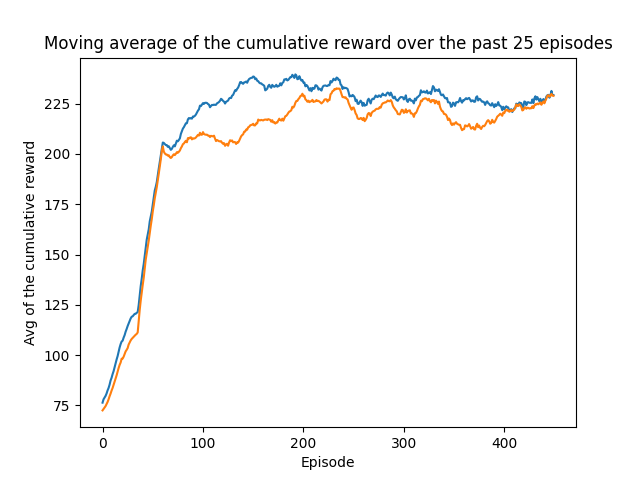
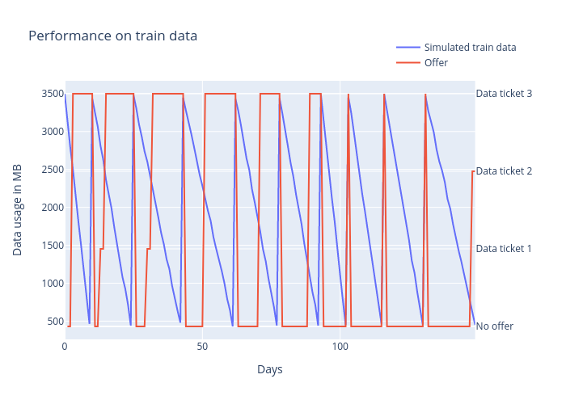
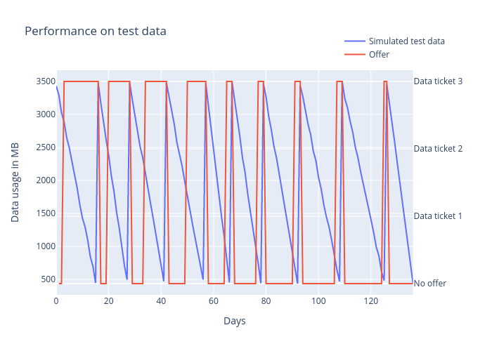

# Data ticket recommender with reinforcement learning

## Summary & results

I builded a data ticket recommender system which predicts when will the customer buy a certain data ticket from the predefined possible offers. The prediciton is based on a linear model trained with stochastic gradient with momentum. The model class can be found under ./classes/linear_model.py.

The program has train and test method, though in an unconvetional way.

- In **train** mode I display the moving average of the cumulative reward over the last 25 episode over a train and a test dataset. Both of these are generated using the ./data/data_simulator.py. Training of the linear model and decay of the agent happens only when the we are in training mode fitting the train dataset. Meanwhile in training mode the test dataset acts as a validation set to avoid overfitting. A quick note that the train was stopped at this episode on purpose as it started to overfit here onwards, but you may try it out!

<p align="center">
  
</p>

- In **test** mode the exploration rate of the agent is set to the minimum epsilon and we do one iteration through the data usage on both train and test dataset to predict what would the model offer. These plots are saved and can be seen below.

| Offers on the train dataset | Offers on the test dataset |
|----------------------------------------------------------|--------------------------------------------------------|
|||

Surprisingly I am much more satisfied with the test offer results. On the train offers it does try to offer other bundles also. Furthermore on the last few tickets perfectly guesses the day of the topup. Ideally I would it to recommend it before it is actually about to happen. On the otherhand the testset offers are a bit too wide at the start, but the later offers are seem really satsifactory.

## Enviroment

The data ticket enviroment with the states consisting of

* Number of times no ticket was bought
* Number of times ticket 1 was bought
* Number of times ticket 2 was bought
* Number of times ticket 3 was bought
* Remaining data on the day
* Days since the last data ticket purchase

In the **init** the basic parameters are defined with a convenience **reset** function to reset the enviroment. The possible states are: No tickets is bought, ticket option 1,2 or 3 is bought. *We assume that no combination of these is bought ever and one day only one ticket is purchased.*

The **offer** function is implemented. After some experimentation I decided to define my reward function based on the avg_days between data ticket purchases, as if I were to give the same reward for a day when ther was a bought ticket and where was not it would just optimise to never offer anything. Clearly giving a larger value for the ticket offers would have made it better, however let us say if a customer buy's ticket only every 100 day, than the reward accumulated over the 100 days has to compete with the reward given on the single purchase day. Thus I decided to scale the reward of the non offering days (1) with the average days between bought tickets.

**_get_obs** simply returns the current state.

## Agent

The agent trains and uses the linear model, with decaying exploration (epsilon) after each round until a lower bound is reached and it has discount rate (gamma) of the reward.

## Data

The simulated is pretty basic for now, linear decrement over varying time periods with minimal noise added.

## Running the code

The main.py has to be run which takes in a few required parameters, such as

- m - train or test mode
- t - name train data, a 1D array stored in csv
- v - name of the test ('validation') data, similarly as before
- eps - number of episodes for training
- em - lower bound for the exploration rate
- ed - decay rate of the exploration rate
- g - discount factor of the reward
- s - random seed for reproducibility

The results shown above can be obtained with the command below:

```console
eugenio@eugenio:~/repos/data_ticket_reinforcement_learning$ python3 main.py -m train -t data_usage -v test_data_usage -eps 475 -em 0.01 -ed 0.09 -g 0.95 -s 7843
```
and similarly for the relevant test plots.

## Further imrpovements

1. The model could be improved, e.g. change the current linear model for a pytorch neural network or any other nonlinear model.
2. If the model is upgraded we could attempt more challenging simulated data, e.g. change between different bundle sizes and/or non linear decrement of the remaining data.
3. These changes might require a more sophisticated reward function.
